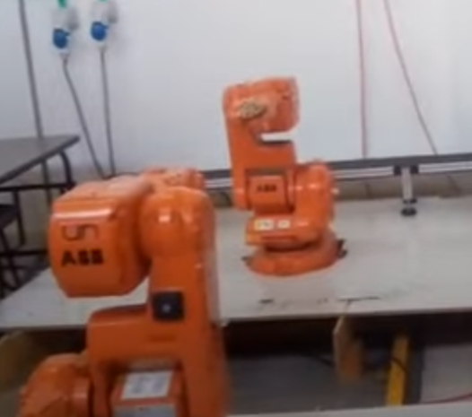
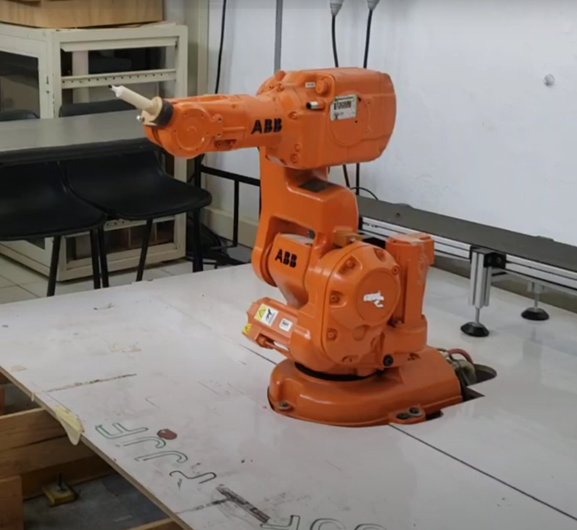

# Laboratorio 2 Robótica

### Integrantes: 
- Abraham Felipe Másmela Ramirez
- Danilo Enrique Insuasty Delgado.
- Nicolás Prieto Solano
## Descripción de la solución planteada

Usando como base el codigo de RAPID de la practica 1 que escribia las iniciales de los miembros del grupo en el tablero se añade la funcionalidad dentro del codigo tal que al oprimir el boton 1 en el tablero de control del robot se ejecutara la rutina de escribir a la vez prendiendo el LED azul del mismo tablero. Adicionalmente al oprimir el boton 2 se ejecutara una funcion que llevara el brazo del robot a la posicion de mantenimiento.

## Entradas y salidas digitales añadidas al programa.
Se agregaron dos entradas y una salida digital al programa realizado en robotStudio. En el mundo físico las entradas digitales corresponden a dos botones ubicados en la zona de control del robot, mientras que la salida digital representa una luz azul dispuesta también en la misma caja donde se encuentran los botones.
La tabla de entradas y salidas digitales se encuentra en la siguiente imagen

## Código de condicionales y bucle en rapid.
El código main realizado en rapid se muestra en la siguiente imagen.

Si la entrada digital (El botón 1) se aprieta y la entrada digital 2 (El botón 2) esta apagado, el robot empieza a realizar el movimiento de escritura y se prende un led, cuando este algoritmo acaba y se aprieta el botón 2, el robot empieza a realizar el movimiento de mantenimiento y se apaga el led

El video de la simulacion con las entradas y salidas digitales es el siguiente: (dar clic en la imagen)

<h2>Videos:</h2>

<h3>1) Videos de funcionamiento del robot:</h3>
  <h4>a) Video 1 (hacer click en la imagen):</h4>
  
  <h4>a) Video 2 (hacer click en la imagen):</h4>
  
